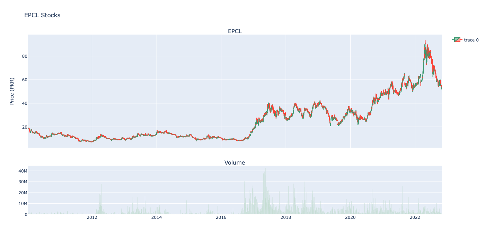
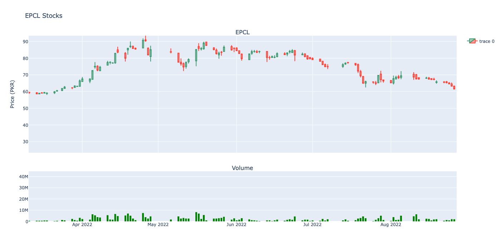
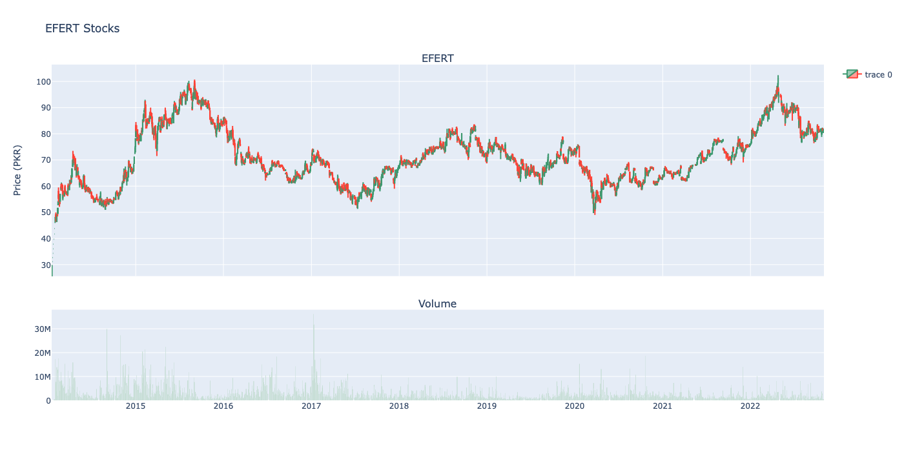
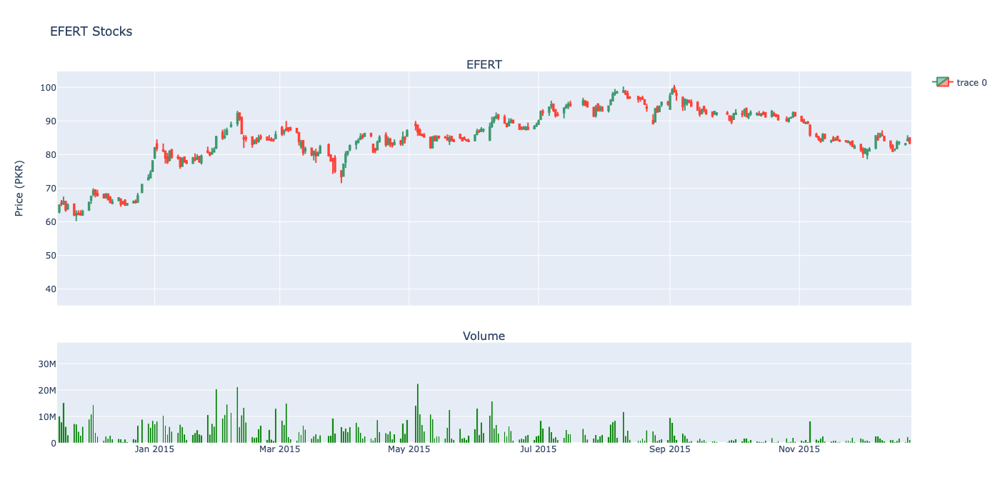

[](https://www.python.org/)  

 ![RuboCop](https://img.shields.io/badge/code%20style-PEP8-green?style=for-the-badge&logo=data:image/svg%2bxml;base64,PHN2ZyB4bWxucz0iaHR0cDovL3d3dy53My5vcmcvMjAwMC9zdmciIHZpZXdCb3g9IjAgMCAzMiAzMiI+PHRpdGxlPmZpbGVfdHlwZV9ydWJvY29wPC90aXRsZT48cGF0aCBkPSJNMjcuMDUsMTMuOVYxM2ExLjc5MywxLjc5MywwLDAsMC0xLjgtMS44SDYuNjVBMS43OTMsMS43OTMsMCwwLDAsNC44NSwxM3YuOWExLjUyNSwxLjUyNSwwLDAsMC0uNywxLjJ2Mi40YTEuMzg3LDEuMzg3LDAsMCwwLC43LDEuMnYuOWExLjc5MywxLjc5MywwLDAsMCwxLjgsMS44aDE4LjdhMS43OTMsMS43OTMsMCwwLDAsMS44LTEuOHYtLjlhMS41MjUsMS41MjUsMCwwLDAsLjctMS4yVjE1LjFBMS43NDIsMS43NDIsMCwwLDAsMjcuMDUsMTMuOVoiIHN0eWxlPSJmaWxsOiNjNWM1YzUiLz48cGF0aCBkPSJNMTUuOTUsMmE5LjkyNSw5LjkyNSwwLDAsMC05LjgsOC42aDE5LjZBOS45MjUsOS45MjUsMCwwLDAsMTUuOTUsMloiIHN0eWxlPSJmaWxsOiNjNWM1YzUiLz48cG9seWdvbiBwb2ludHM9IjEzLjA1IDI0IDE4Ljg1IDI0IDE5LjQ1IDI0LjcgMjAuMzUgMjQgMTkuNDUgMjIuOSAxMi40NSAyMi45IDExLjU1IDI0IDEyLjQ1IDI0LjcgMTMuMDUgMjQiIHN0eWxlPSJmaWxsOiNjNWM1YzUiLz48cGF0aCBkPSJNMjMuNTUsMTcuNkg4LjM1YTEuMywxLjMsMCwxLDEsMC0yLjZoMTUuM2ExLjMyNCwxLjMyNCwwLDAsMSwxLjMsMS4zQTEuNDkzLDEuNDkzLDAsMCwxLDIzLjU1LDE3LjZaIiBzdHlsZT0iZmlsbDojZWMxYzI0Ii8+PHBhdGggZD0iTTIzLjA1LDIydjMuOGExLjk2NywxLjk2NywwLDAsMS0xLjksMS45aC0xYS44NjQuODY0LDAsMCwxLS42LS4zbC0xLjItMS42YS42LjYsMCwwLDAtLjYtLjNoLTMuNmEuNzY0Ljc2NCwwLDAsMC0uNS4ybC0xLjMsMS42YS42LjYsMCwwLDEtLjYuM2gtMWExLjk2NywxLjk2NywwLDAsMS0xLjktMS45VjIySDYuNTV2My44YTQuMjI1LDQuMjI1LDAsMCwwLDQuMiw0LjJoMTAuNGE0LjIyNSw0LjIyNSwwLDAsMCw0LjItNC4yVjIyWiIgc3R5bGU9ImZpbGw6I2M1YzVjNSIvPjwvc3ZnPg==) 

#### 🔴 This package is no longer maintained for any issues and bugs 🔴 

# psx-data-reader
with psx-data-reader, you can scrape the data of Pakistan stock exchange. psx-data-reader is super easy to use and handles everything for you. Just specify which company's stock data you want and how much you want, and the rest is done for you.

           

## Overview 
The psx-data-reader was written with fast use in mind. It provides the following key features

- can scrape all historical data till current date
- can scrape data for of multiple companies in a single line of code
- returns a `Pandas DataFrame` for the scraped data
- for better download speed, It does not request the complete data in a single network request rather it makes chunks of data to be downloaded and uses threads to open requests for different chunks of data, hence results in better speed

In the following paragraphs, I am going to describe how you can get and use Scrapeasy for your own projects.


## Installation

To get psx-data-reader, either fork this github repo or simply use Pypi via pip.

```bash
$ pip install psx-data-reader
```

## Usage

First, import stocks and tickers from psx

```
from psx import stocks, tickers
```

to get the information of all the companies in Pakistan stock Exchange....

```
tickers = tickers()
```


to scrape the data of **Silk Bank Limited** we have pass its ticker (symbol) to the `stocks` method with proper start and end date. and it will return a DataFrame with the scraped data

```
data = stocks("SILK", start=datetime.date(2020, 1, 1), end=datetime.date.today())
```


we can also download the data of multiple companies in a single call to `stocks` method by passing a list or tuple of symbols


```
data = stocks(["SILK", "PACE"], start=datetime.date(2020, 1, 1), end=datetime.date.today())
```

and now the returned DataFrame object will have a hierarchical index on rows.

## Example Graph







## Author Info
<p align="left">
<a href="mailto:muhammmadamir5670@gmail.com"></a>
<a href = "https://www.linkedin.com/in/muhammad-amir-9826b71b5/"></a>
<a href = "https://twitter.com/Daniyal60990408/"></a>
<a href="https://www.facebook.com/daniyal.abbasi.1610/">

</a>
<a href = "https://www.instagram.com/the_infamous_abbasi/"></a>
</p>

